# CAST AI - project for the Environment of Services Implementation AGH course.

## Topic

CAST AI - the leading all-in-one platform for Kubernetes automation, optimization, security, and cost management.

## Authors
- [Jakub Łubkowski](https://github.com/jakobcodes)
- [Kamil Miśkowiec](https://github.com/miskowieck)
- [Marcin Mikuła](https://github.com/mamikula)
- [Szymon Słota](https://github.com/sslota)

## Group 

Year: 2024
 
Group: nr. 5 - Thursday, 11:30 - 13:00

## 1. Introduction

[CAST AI](https://cast.ai/) is a cloud optimization platform that cuts cloud bills in half for AWS,
Google Cloud Platform, and Microsoft Azure customers who use the cloudnative technology of Kubernetes. Powered by AI, it analyzes multiple data
points to find an optimal cost-performance ratio.

### Goal of the project 

The aim of this project is to construct and perform a simple case study that would allow for familiarization with CAST.AI technology, which is an all-in-one platform for Kubernetes automation, optimization, security, and cost management.

## 2. Theoretical background/technology stack

CAST AI is an all-in-one platform for Kubernetes automation, optimization, security, and cost management. It abstracts layers of provider-specific technical complexity, so you can manage Kubernetes operations on all three major cloud providers with ease.

The platform comes with cost monitoring for real-time and longer-period cost reports at the cluster, namespace, and workload level. It also offers cost optimization suggestions and automatic optimization using autoscaling, spot instance automation, bin packing, and other features.

At the same time, CAST AI also checks your cluster security configuration for misconfigurations and any potential vulnerabilities and automatically prioritizes the fixes to improve your security posture. It also lets you scan your cluster against industry standards, incl. CIS Benchmarks and many more.

## 3. Case study concept description

In this case study, we will be using demo microservices provided by Google. The demo can be found at this link: https://github.com/GoogleCloudPlatform/microservices-demo. This set of demo microservices will be deployed on the AWS Cloud.
We will begin by setting up an environment on CAST AI for the microservices to run. Following this, we will deploy the microservices and monitor their performance, cost, and security using the tools provided by the CAST AI platform.

This hands-on experience will provide practical insights into the capabilities and benefits of using CAST AI for cloud optimization, Kubernetes automation, security enhancement, and cost management.

### Google microservices demo

**Online Boutique** is composed of 11 microservices written in different
languages that talk to each other over gRPC.

| Service                                              | Language      | Description                                                                                                                       |
| ---------------------------------------------------- | ------------- | --------------------------------------------------------------------------------------------------------------------------------- |
| [frontend](/src/frontend)                           | Go            | Exposes an HTTP server to serve the website. Does not require signup/login and generates session IDs for all users automatically. |
| [cartservice](/src/cartservice)                     | C#            | Stores the items in the user's shopping cart in Redis and retrieves it.                                                           |
| [productcatalogservice](/src/productcatalogservice) | Go            | Provides the list of products from a JSON file and ability to search products and get individual products.                        |
| [currencyservice](/src/currencyservice)             | Node.js       | Converts one money amount to another currency. Uses real values fetched from European Central Bank. It's the highest QPS service. |
| [paymentservice](/src/paymentservice)               | Node.js       | Charges the given credit card info (mock) with the given amount and returns a transaction ID.                                     |
| [shippingservice](/src/shippingservice)             | Go            | Gives shipping cost estimates based on the shopping cart. Ships items to the given address (mock)                                 |
| [emailservice](/src/emailservice)                   | Python        | Sends users an order confirmation email (mock).                                                                                   |
| [checkoutservice](/src/checkoutservice)             | Go            | Retrieves user cart, prepares order and orchestrates the payment, shipping and the email notification.                            |
| [recommendationservice](/src/recommendationservice) | Python        | Recommends other products based on what's given in the cart.                                                                      |
| [adservice](/src/adservice)                         | Java          | Provides text ads based on given context words.                                                                                   |
| [loadgenerator](/src/loadgenerator)                 | Python/Locust | Continuously sends requests imitating realistic user shopping flows to the frontend.                                              |

## 4. Solution architecture

## 5. Environment configuration description

The environment configuration for our project is established on the AWS Cloud, leveraging the CAST AI platform and the Google microservices demo.

To configure this environment, we started by setting up a Kubernetes cluster on Amazon EKS, using AWS as our cloud provider. Amazon EKS provides a managed environment for deploying, managing, and scaling our containerized applications using Kubernetes.

Following this, we configured CAST AI platform to monitor and manage the Kubernetes deployments. CAST AI provides an all-in-one platform for Kubernetes automation, optimization, security, and cost management. Its inbuilt features of autoscaling, spot instance automation, bin packing etc., will help us to optimize the resources and manage the cost effectively.

The Google microservices demo we're utilising is a cloud-native microservices demo application. The application is composed of 11 microservices that simulate an e-commerce website. Each microservice is written in a different language, and they communicate with each other over gRPC. These services were deployed on the Kubernetes cluster.

In conclusion, the environment configuration involves the strategic setup and integration of various technologies to create a platform for our case study.

## 6. Installation method

## 7. How to reproduce - step by step

### Infrastructure as Code approach
Infrastructure will be deployed using IaC (Infrastructure as Code) approach using Terraform. 

## 8. Demo deployment steps:

### Configuration set-up
curl -H "Authorization: Token" "https://api.cast.ai/v1/agent.yaml?provider=eks" | kubectl apply -f -

### Results presentation

#### Home view (list of created clusters)

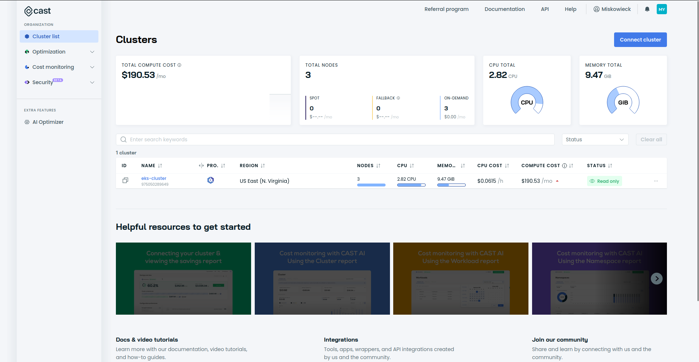

#### Dashboard of our cluster

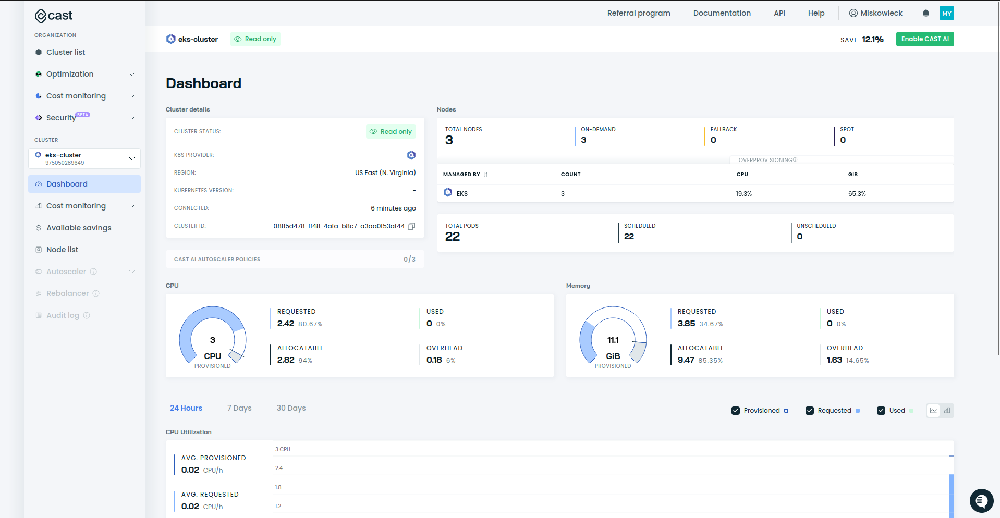
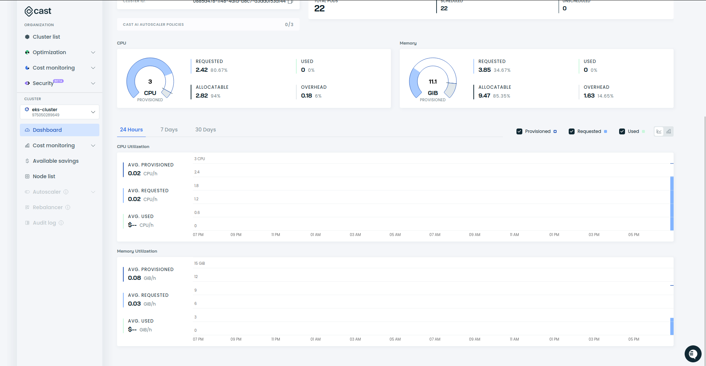

#### Cost monitoring

- Cost per cluster
  
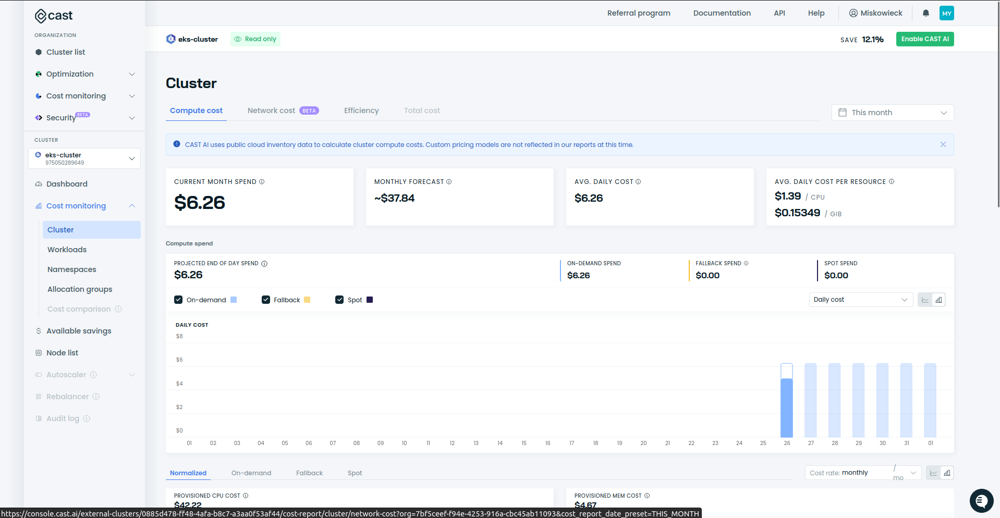

- Cost per service

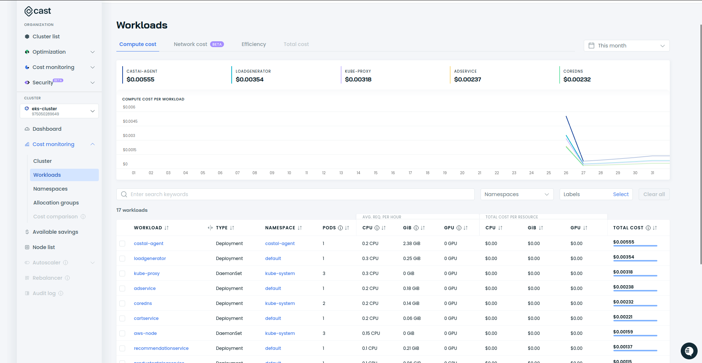
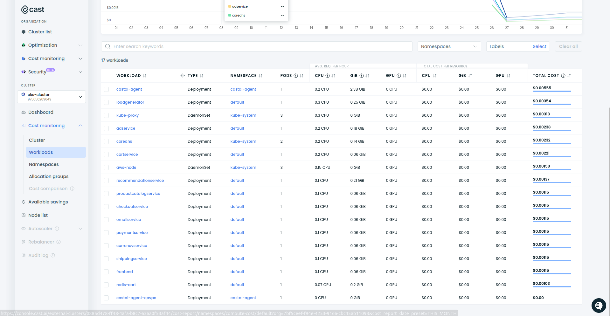

- Cost per namespace

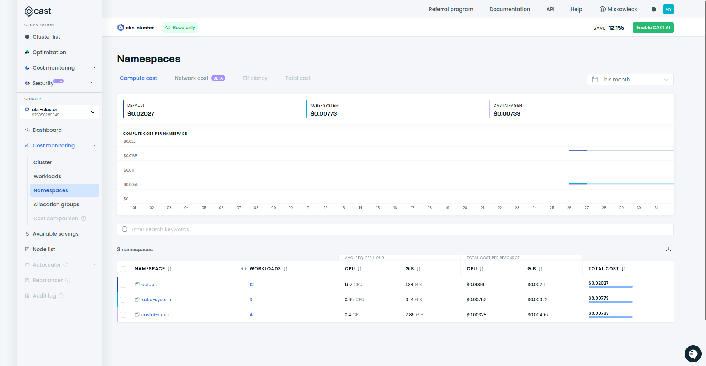

#### Available savings

- without using spot instances
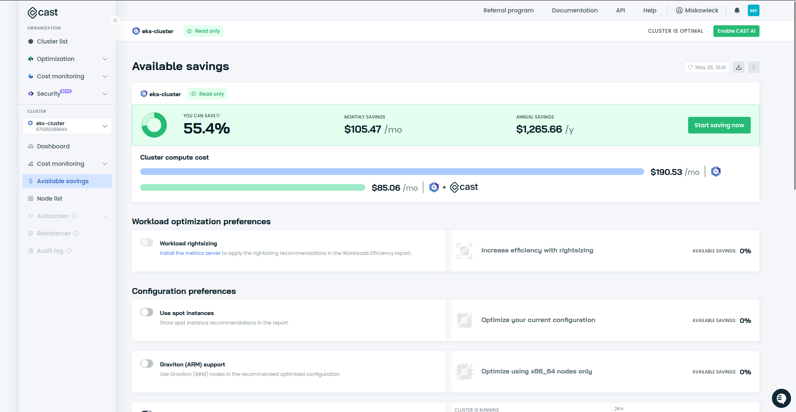

- with using spot instances
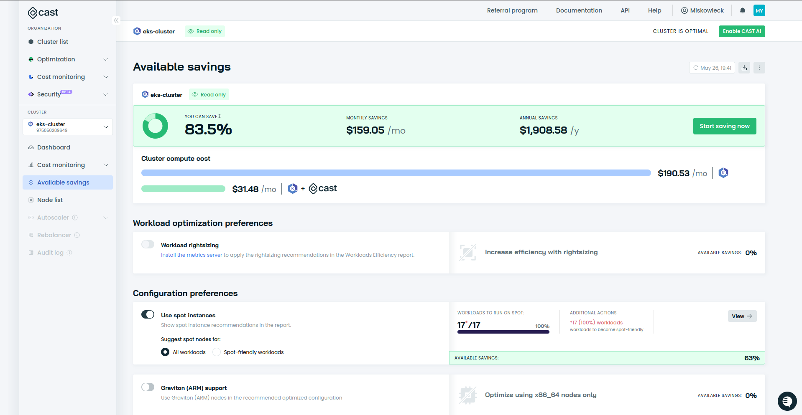

#### Node list

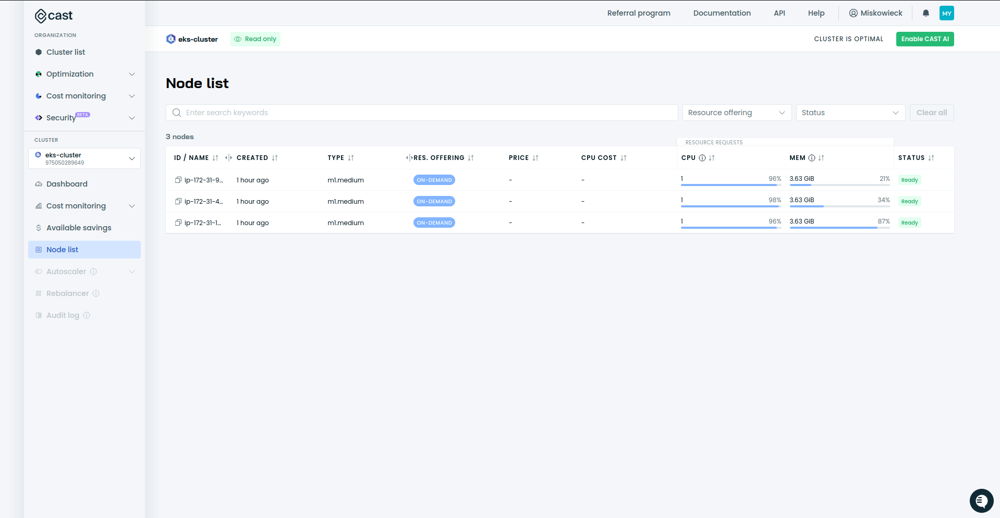

#### Cluster efficiency
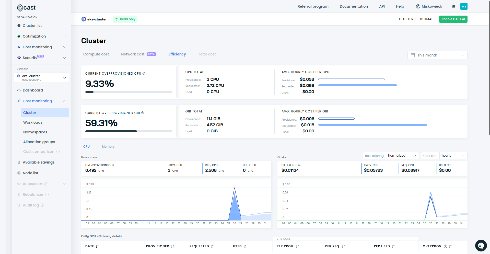

#### Security - best practices

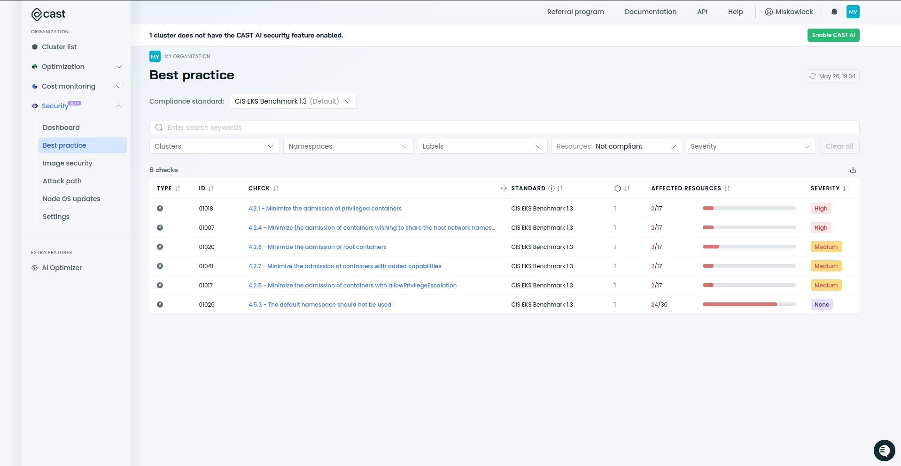

#### Scheduled rebalancing

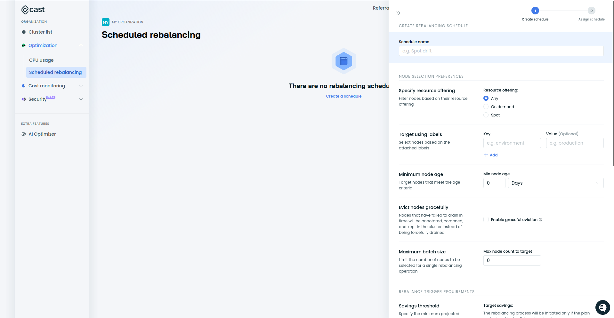

## 9. Summary – conclusions

Our project has provided valuable insights and practical experience in Kubernetes automation, optimization, security, and cost management. Here are the key conclusions drawn from our study:

1. **Efficiency Gains**: CAST AI significantly enhances the efficiency of Kubernetes operations by automating resource management and optimization tasks, reducing the manual effort required.

2. **Cost Savings**: The platform's ability to optimize cloud resource usage, including features like spot instance automation and bin packing, effectively reduces operational costs. This was evident in the cost savings observed in our case study.

3. **Scalability**: CAST AI's autoscaling capabilities ensure that the Kubernetes cluster can dynamically adjust to varying loads, maintaining performance while optimizing resource usage.

4. **Security Enhancements**: The security audit and automatic prioritization of fixes provided by CAST AI improves cluster’s security posture, ensuring compliance with industry standards like CIS Benchmarks.

5. **Real-Time Monitoring**: The platform's real-time monitoring tools for cost, performance, and security allowed us to maintain continuous oversight of our Kubernetes environment, quickly identifying and addressing any issues.

6. **Integration and Setup**: Integrating CAST AI with AWS and deploying the Google microservices demo on the Kubernetes cluster was straightforward. The detailed documentation and support from CAST AI facilitated a smooth setup process.

7. **Comprehensive Insights**: The detailed dashboards and reports on cost per cluster, service, and namespace provided us with granular insights into our cloud expenditure, highlighting areas for potential savings.

8. **Main Drawback**: The primary limitation we encountered was that the free tier of CAST AI only provided observational tools. This restriction prevented us from fully testing the platform's optimization and automation capabilities in practice.

## 10. References

1. [CAST AI Official Website](https://cast.ai)
2. [Amazon EKS Documentation](https://docs.aws.amazon.com/eks)
3. [Google Cloud Platform Microservices Demo](https://github.com/GoogleCloudPlatform/microservices-demo)
4. [Kubernetes Documentation](https://kubernetes.io/docs)
5. [CIS Kubernetes Benchmark](https://www.cisecurity.org/benchmark/kubernetes)
6. [Terraform Documentation](https://www.terraform.io/docs)

